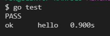
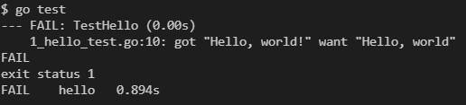
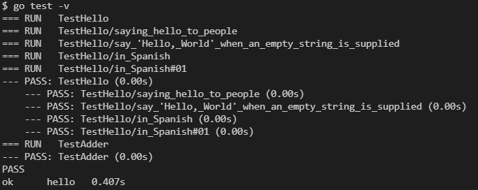
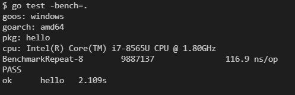

# [테스트로 배우는 GO](https://quii.gitbook.io/learn-go-with-tests/)

### TDD

1. 테스트 케이스 작성
2. 실행 후 실패한 테스트의 오류 메세지 확인
3. 테스트 통과할 수 있는 코드 작성
4. 리팩토링

### 모듈 생성

```
$ go mod init 이름
```

### 테스트 코드 돌리기

```cmd
$ go test
```

- success  
   
- fail  
   

### 테스트 코드 별 결과 보기

```cmd
$ go test -v
```

- status
  

### 빌드하기

```cmd
$ go build
```

### 테스트 작성 규칙

- `xxx_test.go` 라는 파일 안에 테스트 코드를 작성해야함
- 테스트 함수는 `Test` 로 시작해야함
- 하나의 인수 `t *testing.T` 만 사용해야함
- `t *testing.T` 를 사용하려면 `import "testing"` 을 미리 선언해야함

### 벤치마크

- `BenchmarkXxx` 로 시작해야함
- 하나의 인수 `t *testing.B` 사용
- b.N만큼의 실행 시간, 소요 시간을 측정 함
- 벤치마크 함수들 실행

```
$ go test -bench=.
```

- example  
  
